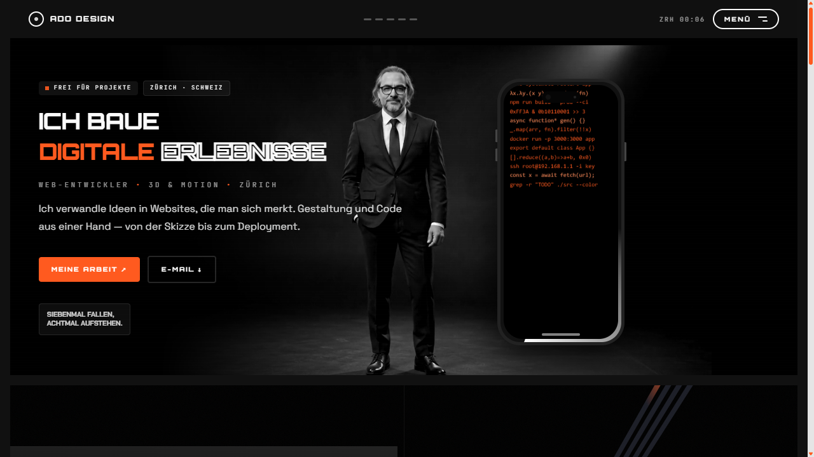

<div align="center">

# ADO Design

**Mobil-optimierter Portfolio-Auftritt · React · Framer Motion · GSAP**

[](https://ado-design.vercel.app/)
[](https://www.typescriptlang.org/)
[](https://react.dev/)
[](https://vitejs.dev/)



</div>

---

## Über das Projekt

Ein-Seiten-Portfolio mit fünf Abschnitten (Über mich, Projekte, Skills,
Werdegang, Kontakt). Jeder Abschnitt trägt ein eigenes Foto-Effekt: TV-Static,
Neon-Grid, Flüssigverzerrung (SVG `feDisplacementMap`), Lupe und ein
faltender Papierflieger — auf dem Desktop per Maus-Hover, auf dem Handy per
Halten (`pointerdown`/`pointerup`), nicht per unzuverlässigem CSS-`:hover`.

Die Werdegang-Zeitleiste füllt sich `scrub`-exakt mit **GSAP ScrollTrigger**;
alle anderen Bewegungen laufen über **Framer Motion**.

## Funktionen

- 📱 **Touch-first Effekte** — jeder Bildeffekt funktioniert identisch auf
  Maus und Finger, kein `hover`-only Verhalten
- 🖼️ **WebP-optimierte Bilder** — aktive Fotos zusammen unter 500 KB
  (vorher ~7 MB an PNG/JPG)
- 🎯 **GSAP ScrollTrigger** — scroll-gebundene Zeitleiste im Werdegang-Bereich
- ♿ **Barrierefrei** — Tastatur-Navigation, `aria-label`s, `prefers-reduced-motion`
  respektiert
- 🎨 **Fluide Masse** — keine Haltepunktketten für Schrift/Abstand, alles
  über `clamp()` (siehe `src/index.css`)

## Tech-Stack

| Bereich | Werkzeug |
|---|---|
| Framework | React 19 + TypeScript |
| Build | Vite 8 |
| Styling | Tailwind CSS 4 |
| Animation | Framer Motion, GSAP (ScrollTrigger) |
| Smooth Scroll | Lenis |
| Lint | oxlint (react, jsx-a11y, react-perf Plugins) |

## Lokal einrichten

Voraussetzung: [Node.js](https://nodejs.org/) 18 oder neuer.

```bash
# Repository klonen
git clone https://github.com/Delixch/ado-design.git
cd ado-design

# Abhängigkeiten installieren
npm install

# Entwicklungsserver starten (http://localhost:5173)
npm run dev
```

### Weitere Befehle

| Befehl | Wirkung |
|---|---|
| `npm run dev` | Entwicklungsserver mit Hot-Reload |
| `npm run build` | Typprüfung (`tsc -b`) + Produktions-Build nach `dist/` |
| `npm run preview` | Lokale Vorschau des Produktions-Builds |
| `npm run lint` | oxlint über den gesamten Quellcode |

## Projektstruktur

```
src/
├── components/       # Ein Abschnitt pro Datei (Hero, About, Projects, …)
├── lib/              # Geteilte Hooks & Daten (Scroll, Navigation, Projektliste)
└── index.css         # Farbpalette, fluide Masse, Keyframes
public/
├── images/           # WebP-Fotos je Abschnitt
└── shots/            # Projekt-Screenshots für die Projektliste
```

## Kontakt

**Adnan Aydin** — Web-Entwickler, Zürich
📬 [adnan.aydin@bluewin.ch](mailto:adnan.aydin@bluewin.ch) · [Instagram](https://www.instagram.com/adnanaydin53/) · [GitHub](https://github.com/Delixch)
